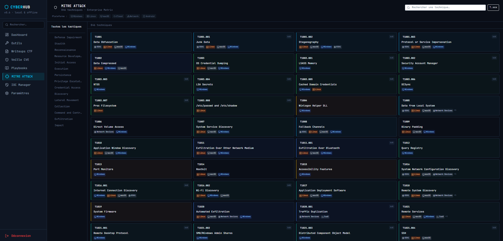
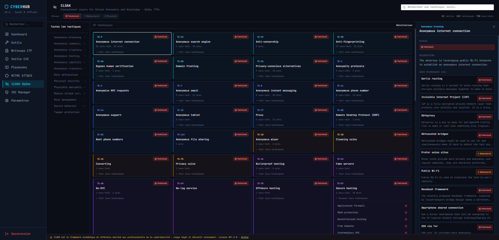
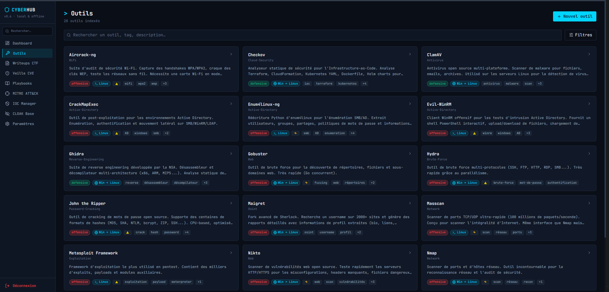
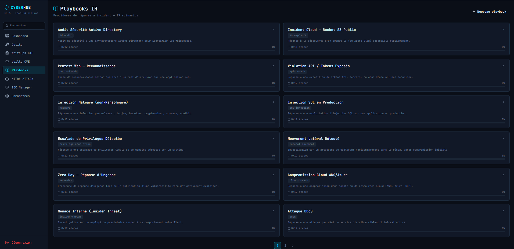
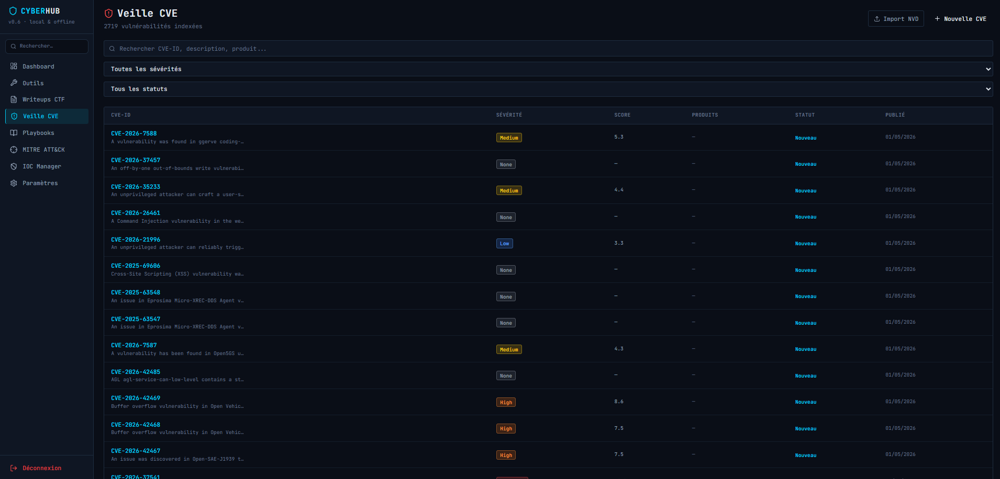
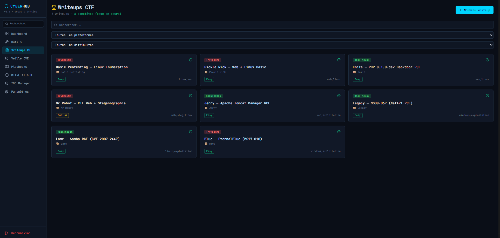
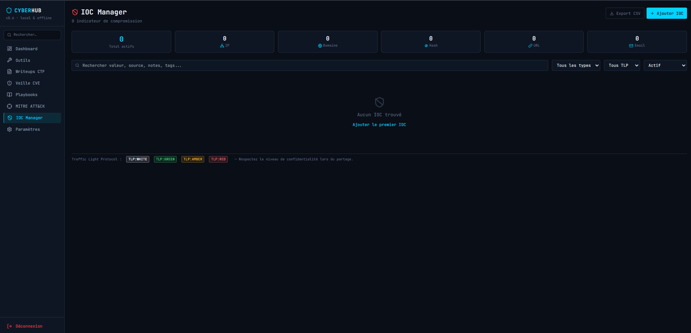
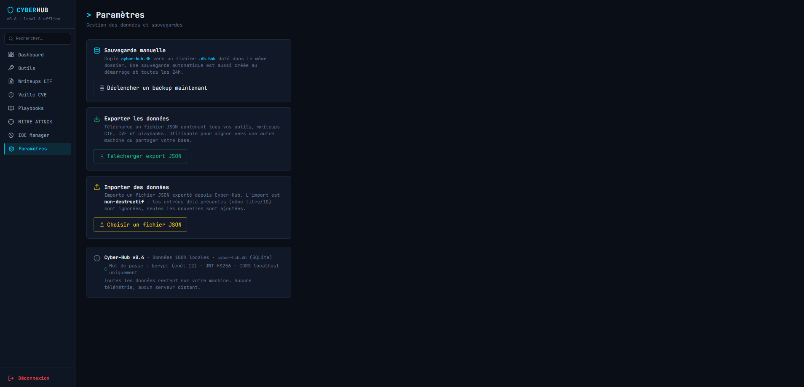

# CYBER-HUB v0.9

> Hub de ressources cybersécurité — 100% local, 100% offline


Application de bureau pour centraliser vos outils, writeups CTF, veille CVE, playbooks de réponse à incident, gestion d'IOC, base de connaissances OpSec, analyse BGP/AS, OSINT et investigation.

---

## 📸 Aperçu de l'application

### Dashboard


### MITRE ATT&CK


### CLOAK OpSec


### Outils


### Playbooks


### Veille CVE


### Writeups CTF


### IOC Manager


### Paramètres


---

## Fonctionnalités

### Modules stables

- **Dashboard** — KPIs visuels, graphiques (writeups par plateforme, CVE par sévérité, top outils)
- **Outils** — Catalogue de 28 outils avec fiches techniques détaillées (Nmap, Hydra, Metasploit, SQLMap, Gobuster, Trivy, Ghidra…)
- **CTF Writeups** — Gestion par plateforme (TryHackMe, HackTheBox)
- **Veille CVE** — Base locale + import NVD JSON 2.0 + recherche par sévérité/CVSS
- **Playbooks** — 19 procédures de réponse à incident interactives (checklist step-by-step)
- **MITRE ATT&CK Enterprise** — 823 techniques, 14 tactiques, indexées offline dans SQLite
- **IOC Manager** — Gestionnaire centralisé d'Indicateurs de Compromission (IP, domaine, hash, URL, email, CIDR)
- **CLOAK OpSec** — 720 sous-techniques adversariales (anonymat, dissimulation, OpSec) · 13 tactiques · embarqué offline
- **BGP / AS Lookup** — Proxy BGPView avec cache SQLite TTL 1h, bascule vers RIPE Stat en cas d’échec, résolution DNS-over-HTTPS, et statut de santé exposé dans l’UI
- **BGP Historian** — Snapshots périodiques d'AS, diff entre snapshots, alertes sur changements de routage
- **OSINT Runner** — Execution locale d'outils OSINT (theHarvester, Sherlock, Maigret) avec stream de sortie, extraction d'IOCs et import direct dans l'IOC Manager
- **Notes d'investigation** — éditeur opérationnel avec liens vers IOCs, MITRE, CVE et recherche fulltext
- **Hash Analyzer MalwareBazaar** — analyse de hashes MD5/SHA256 avec cache SQLite 6h pour enrichir les IOC et les investigations
- **Cheatsheets interactives** — plus de 16 outils avec commandes paramétrables, preview en temps réel et copie en un clic
- **Dashboard v2** — widgets supplémentaires BGP Alerts, IOCs récents, corrélations récentes et notes récentes

---

## Stack technique

| Composant        | Technologie                                                    |
|------------------|----------------------------------------------------------------|
| Backend          | Go 1.26+ · Gin · GORM · SQLite                                |
| Frontend         | React 18 · TypeScript strict · Vite · Tailwind CSS · Node.js  |
| Base de données  | SQLite WAL (fichier local `cyber-hub.db`)                     |
| Authentification | JWT HS256 · bcrypt                                            |
| MITRE ATT&CK     | JSON STIX 2.0 officiel · seed offline                         |
| CLOAK            | concealment-data.json · embarqué via go:embed                 |
| BGP              | BGPView API (bgpview.io) · cache SQLite · fallback RIPE Stat · DNS-over-HTTPS · aucune clé API |

---

## Prérequis

- **Go** ≥ 1.26 — [golang.org/dl](https://golang.org/dl/)
- **Node.js** ≥ 18 + npm — [nodejs.org](https://nodejs.org/) (uniquement pour compiler le frontend React/TypeScript)

---

## Installation & Build

### 1. Cloner le projet

```bash
git clone https://github.com/loic31000/CyberHub.git
cd CyberHub
```

### 2. Build du frontend (React)

```bash
cd frontend
npm install
npm run build
cd ..
```

> Le build est copié dans `backend/web/` et embarqué dans le binaire Go.

### 3. Compiler le backend (Go)

```bash
cd backend
go build -ldflags="-s -w" -o cyber-hub.exe .   # Windows
# go build -ldflags="-s -w" -o cyber-hub .      # Linux/macOS
```

> Les flags `-s -w` strippent les symboles de debug — binaire ~30% plus léger.

### 4. Lancer l'application

```bash
./cyber-hub.exe          # Windows
# ./cyber-hub            # Linux/macOS
```

L'application démarre sur **http://localhost:7743** et ouvre le navigateur automatiquement.

---

## Premier démarrage

1. Accéder à `http://localhost:7743`
2. Créer un compte local (mot de passe — stocké localement, jamais envoyé)
3. L'application charge automatiquement les données de référence (outils, playbooks, CVE, CTF writeups)
4. Le seed MITRE ATT&CK s'exécute en arrière-plan (nécessite une connexion internet une seule fois)
5. CLOAK est disponible immédiatement — données embarquées, aucune connexion requise
6. BGP Lookup nécessite une connexion internet pour interroger BGPView; le backend supporte un fallback RIPE Stat et une résolution DNS-over-HTTPS en cas d’échec (résultats mis en cache 1h)

---

## Modules disponibles

### Outils (28 fiches)

| Catégorie | Outils |
|-----------|--------|
| Réseau | Nmap, Masscan |
| Bruteforce | Hydra, John the Ripper |
| Web | SQLmap, Nikto, ffuf, WPScan, OWASP ZAP |
| Exploitation | Metasploit Framework |
| Active Directory | CrackMapExec, Evil-WinRM, enum4linux-ng |
| Wi-Fi | Aircrack-ng |
| OSINT | theHarvester, Sherlock, Maigret |
| Cloud/SecOps | Trivy, Prowler, Checkov |
| Antivirus | ClamAV |
| Reverse | Ghidra |
| Forensics | Volatility 3, YARA |

### OSINT Runner & Cheatsheets

- **OSINT Runner** — exécution locale d'outils OSINT avec extraction automatique d'IOCs et flux de sortie en temps réel.
- **Cheatsheets interactives** — commandes paramétrables pour plus de 16 outils, variables dynamiques et copier/coller rapide.

### CTF Writeups (8 writeups)

| Machine | Plateforme | Difficulté |
|---------|------------|------------|
| Blue — EternalBlue | TryHackMe | Easy |
| Lame — Samba RCE | HackTheBox | Easy |
| Legacy — MS08-067 | HackTheBox | Easy |
| Jerry — Tomcat RCE | HackTheBox | Easy |
| Mr Robot — Web + Stegano | TryHackMe | Medium |
| Knife — PHP Backdoor | HackTheBox | Easy |
| Pickle Rick — Web + Linux | TryHackMe | Easy |
| Basic Pentesting — Linux | TryHackMe | Easy |

### Playbooks (19 procédures)

- Réponse Ransomware
- Investigation Phishing
- Brute Force SSH/RDP détecté
- Compromission Active Directory
- Détection Exfiltration de Données
- Web Shell Détecté
- Supply Chain Attack
- Attaque DDoS
- Menace Interne (Insider Threat)
- Compromission Cloud AWS/Azure
- Zero-Day — Réponse d'Urgence
- Mouvement Latéral Détecté
- Escalade de Privilèges Détectée
- Injection SQL en Production
- Infection Malware (non-Ransomware)
- Violation API / Tokens Exposés
- Pentest Web — Reconnaissance
- Incident Cloud — Bucket S3 Public
- Audit Sécurité Active Directory

### MITRE ATT&CK Enterprise

**823 techniques · 14 tactiques · Format STIX 2.0**

Tactiques couvertes :
Reconnaissance → Resource Development → Initial Access → Execution → Persistence → Privilege Escalation → Defense Evasion → Credential Access → Discovery → Lateral Movement → Collection → Command and Control → Exfiltration → Impact.

### CLOAK OpSec

**720 sous-techniques · 13 tactiques · 100% offline**

Base de connaissances sur les techniques d'anonymat et de dissimulation adversariale. Source : [Mick Deben, Leiden University](https://github.com/mickdeben/concealment) — Licence GPL v2.

Tactiques couvertes : Anonymous Browsing · Anonymous Communication · Anonymous Cryptocurrency · Anonymous Hosting · Anonymous Identity · Anonymous Transactions · Data Obfuscation · Physical Security · Plausible Deniability · Reduce Attack Surface · Risk Management · Secure Behavior · Tamper Protection.

Niveaux : `Technical` · `Behavioral` · `Physical`

### IOC Manager

Gestionnaire centralisé des Indicateurs de Compromission :

| Champ | Détail |
|-------|--------|
| Types | IP, Domaine, Hash (MD5/SHA256), URL, Email, **CIDR** |
| TLP | White / Green / Amber / Red |
| Statut | Actif / Archivé / Faux positif |
| Lien MITRE | Technique ATT&CK associable |
| Export | CSV |

> Le type **CIDR** a été ajouté pour permettre l'export direct des préfixes réseau depuis le module BGP Lookup.

### BGP / AS Lookup

Proxy vers l'API BGPView avec mise en cache SQLite (TTL 1h) — aucune clé API requise.

| Mode | Description |
|------|-------------|
| ASN | Lookup complet d'un Autonomous System (infos, préfixes IPv4/IPv6, peers, upstreams, downstreams) |
| IP | Résolution d'une adresse IP vers son AS et ses préfixes |
| Recherche | Recherche libre par nom d'organisation ou description |

Fonctionnalités : navigation entre AS peers, copie en un clic, export IOC (CIDR → IOC Manager), snapshot d'AS, état de santé de l'API BGP.

Implémentation : proxy Go avec cache `BGPCache` (upsert SQLite), timeout 30s, support de fallback RIPE Stat en cas d'échec BGPView ou DNS, cache stale en secours, TypeScript strict (zéro `any`).

### BGP Historian

Suivi des changements de routage BGP dans le temps :

- **Snapshots** — capture parallèle en 5 goroutines (`sync.WaitGroup`) : infos AS, préfixes, peers, upstreams, downstreams
- **Diff** — comparaison de deux snapshots avec détection des préfixes/peers ajoutés ou supprimés (normalisation des slices pour comparaison indépendante de l'ordre)
- **Alertes** — détection automatique des changements lors d'un nouveau snapshot (`prefix_change`, `upstream_change`, `peer_change`, `downstream_change`) · badge rouge dans la sidebar · acquittement manuel
- **Export IOC** — conversion d'un préfixe BGP en IOC de type CIDR

---

## Sécurité

| Couche | Mesure |
|--------|--------|
| Auth | JWT HS256 · bcrypt · secret généré aléatoirement au premier démarrage |
| Réseau | Bind sur `127.0.0.1` uniquement — pas d'accès réseau externe |
| CORS | Whitelist `localhost:7743` + `localhost:5173` (dev) |
| Headers | `X-Frame-Options: DENY` · `X-Content-Type-Options` · `Referrer-Policy` |
| Frontend | TypeScript strict · inputs validés |
| Secrets | Aucun secret en dur — JWT secret stocké en DB |
| BGP | Proxy local uniquement — aucune clé ni credential transmis |

---

## Structure du projet

```
cyber-hub/
├── backend/
│   ├── internal/
│   │   ├── api/
│   │   │   ├── handlers/      # Auth, Tools, CTF, CVE, Playbooks, MITRE, IOC, CLOAK, BGP
│   │   │   ├── middleware/    # Auth, Rate limiter
│   │   │   └── router.go
│   │   ├── mitre/             # Seed MITRE STIX 2.0
│   │   ├── cloak/             # Seed CLOAK (concealment-data.json)
│   │   ├── models/            # Structs GORM (+ BGPCache, BGPSnapshot, BGPAlert)
│   │   └── store/             # Couche données
│   ├── web/                   # Build React embarqué (go:embed)
│   └── main.go
├── frontend/
│   └── src/
│       ├── pages/             # Dashboard, Tools, CTF, CVE, Playbooks, MITRE, IOC, CLOAK, BGPLookup, BGPHistorian
│       ├── components/        # Layout, Sidebar, SearchModal, Pagination, Toast
│       ├── api/client.ts      # Axios + tous les endpoints (bgpApi, cloakAnnotationsApi, threatApi…)
│       ├── store/             # Zustand (auth, toast, ioc)
│       ├── types/             # Types TypeScript (bgp.ts, ioc.ts, threat.ts…)
│       ├── App.tsx
│       └── main.tsx
├── .github/
│   └── screenshots/
└── README.md
```

---

## Développement

```bash
# Terminal 1 — Backend
cd backend
go run cmd/server/main.go

# Terminal 2 — Frontend (hot reload)
cd frontend
npm run dev
```

Frontend sur `http://localhost:5173` (proxy automatique vers backend `7743`).

```bash
# Vérification TypeScript
cd frontend
npx tsc --noEmit

# Formatage Go
cd backend
gofmt -w ./internal/...
```

---

## Changelog

### v0.7 — BGP / AS Lookup + Historian
- **Nouveau module BGP Lookup** — proxy BGPView, 3 modes (ASN / IP / recherche), onglets lazy-loaded, pagination, export IOC
- **Nouveau module BGP Historian** — snapshots parallèles, diff visuel, alertes automatiques sur changements de routage, badge sidebar
- **IOC Manager** — ajout du type `cidr` pour les préfixes réseau
- **Backend** — 3 nouveaux modèles SQLite (`BGPCache`, `BGPSnapshot`, `BGPAlert`), 13 routes `/api/bgp/...`
- **Frontend** — `BGPLookup.tsx`, `BGPHistorian.tsx`, `types/bgp.ts`, `types/threat.ts`, `store/useToastStore.ts`
- **client.ts** — ajout de `bgpApi`, `cloakAnnotationsApi`, `threatApi`

### v0.6
- IOC Manager (IP, domaine, hash, URL, email · TLP · export CSV)
- CLOAK OpSec (720 sous-techniques · annotations utilisateur)
- MITRE ATT&CK Enterprise (823 techniques · 14 tactiques · offline)
- Playbooks interactifs (19 procédures)
- Veille CVE + import NVD
- Dashboard avec KPIs et graphiques

---

## Licence & Avertissement

Cyber-Hub est destiné **exclusivement à un usage légal et éthique** : tests sur vos propres systèmes, environnements de lab, CTF, formation. L'utilisation sur des systèmes sans autorisation explicite est illégale.

CLOAK est distribué sous licence GPL v2 — crédit : Mick Deben, Leiden University.

---

*README mis à jour le 02/05/2026 — Cyber-Hub v0.7*
