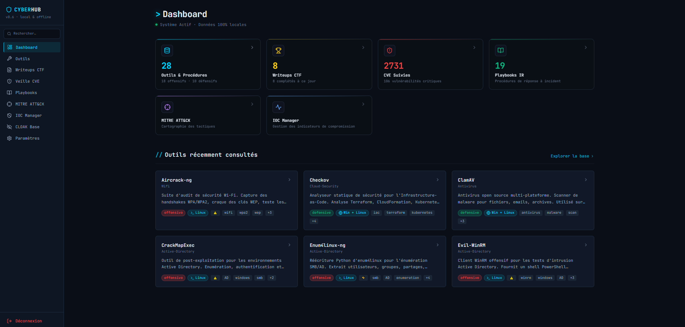
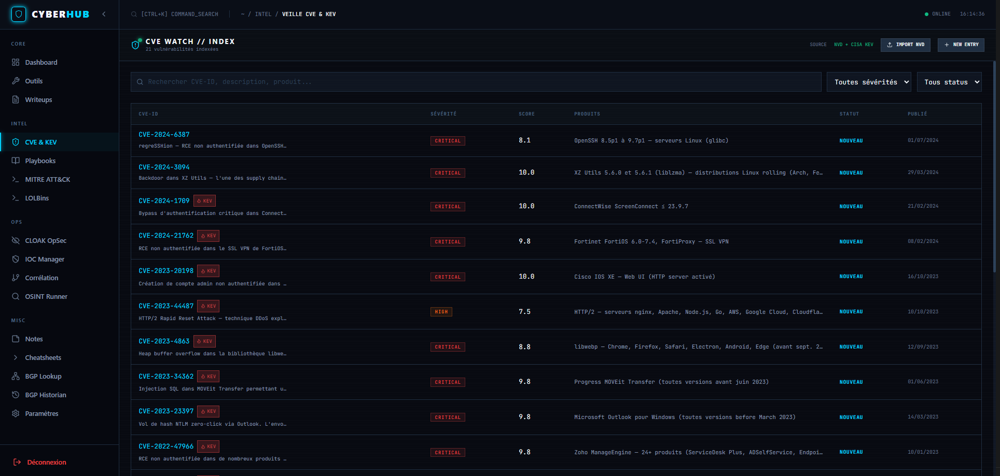
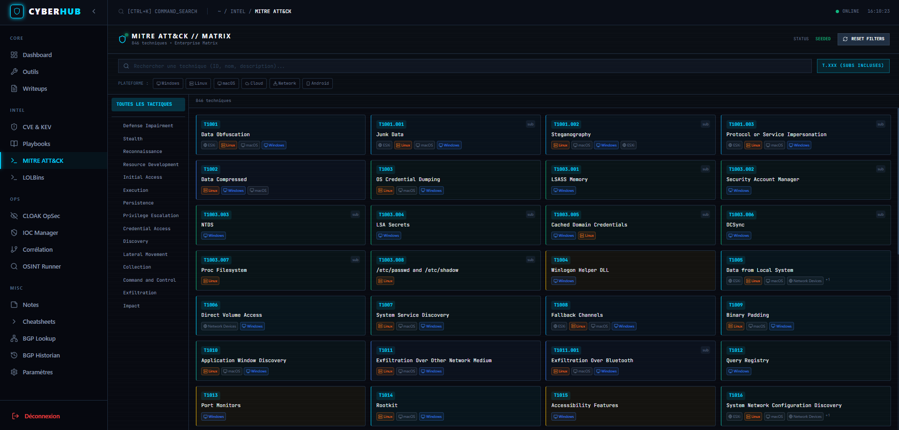
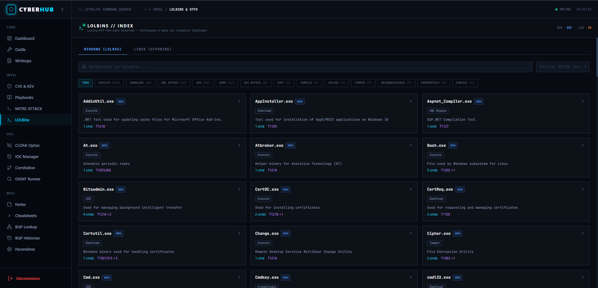
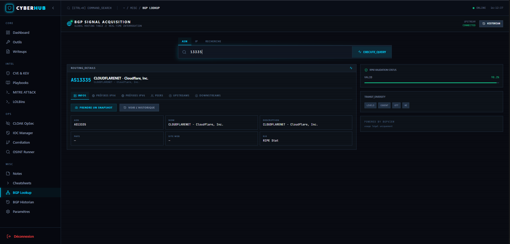
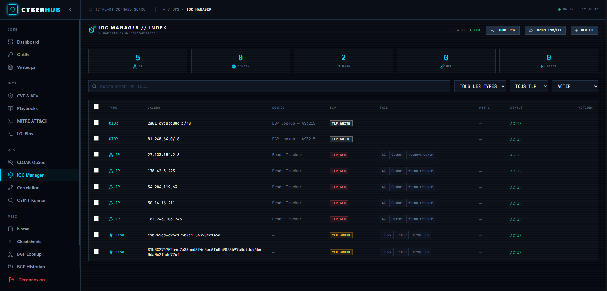
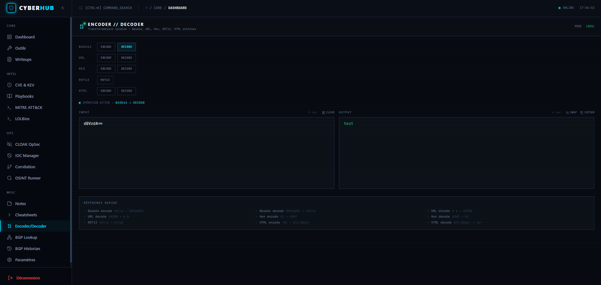
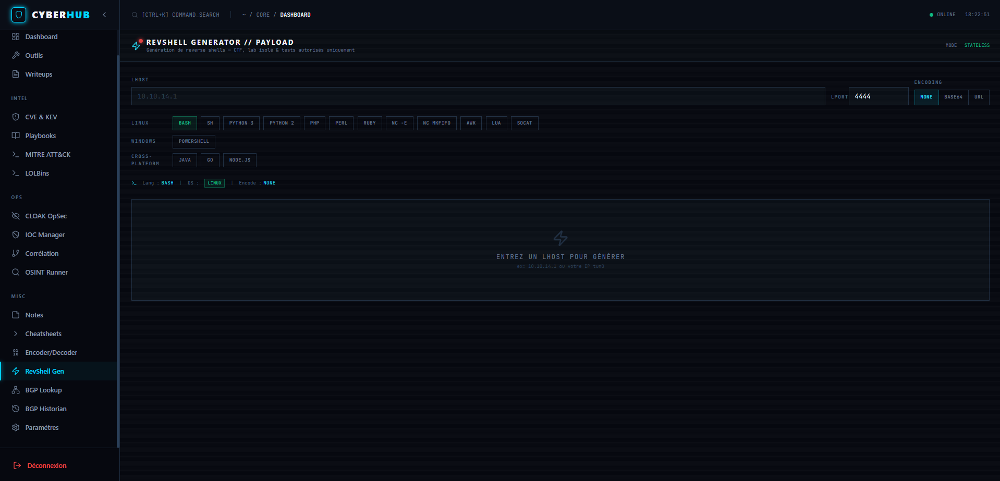

# CYBER-HUB v1.0

> Hub de ressources cybersécurité — 100% local, 100% offline


Application de bureau pour centraliser vos outils, writeups CTF, veille CVE, playbooks de réponse à incident, gestion d'IOC, base de connaissances OpSec, analyse BGP/AS, OSINT et investigation. En v1.0 : enrichissement CISA KEV + EPSS, LOLBins/GTFOBins, import IOC en masse CSV/TXT, synchronisation Feodo Tracker + URLhaus.

---

## 📸 Aperçu de l'application

### Dashboard


### CVE Watch


### MITRE ATT&CK


### LOLBINS


### BGP Lookup


### IOC Manager


## ENCODER / DECODER


## REVSHELL


---

## Fonctionnalités

### Modules stables

- **Dashboard** — KPIs visuels, graphiques (writeups par plateforme, CVE par sévérité, top outils)
- **Outils** — Catalogue de 28 outils avec fiches techniques détaillées (Nmap, Hydra, Metasploit, SQLMap, Gobuster, Trivy, Ghidra…)
- **CTF Writeups** — Gestion par plateforme (TryHackMe, HackTheBox)
- **Veille CVE** — Base locale + import NVD JSON 2.0 (fichier) + import NVD en ligne paginé (clé API optionnelle) + recherche par sévérité/CVSS
- **Playbooks** — 19 procédures de réponse à incident interactives (checklist step-by-step)
- **MITRE ATT&CK Enterprise** — 823 techniques, 14 tactiques, indexées offline dans SQLite
- **IOC Manager** — Gestionnaire centralisé d’Indicateurs de Compromission (IP, domaine, hash, URL, email, CIDR)
- **CLOAK OpSec** — 720 sous-techniques adversariales (anonymat, dissimulation, OpSec) · 13 tactiques · embarqué offline
- **BGP / AS Lookup** — Proxy BGPView avec cache SQLite TTL 1h, bascule vers RIPE Stat en cas d’échec, résolution DNS-over-HTTPS, et statut de santé exposé dans l’UI
- **BGP Historian** — Snapshots périodiques d’AS, diff entre snapshots, alertes sur changements de routage
- **OSINT Runner** — Exécution locale d’outils OSINT (theHarvester, Sherlock, Maigret) avec stream de sortie, extraction d’IOCs et import direct dans l’IOC Manager
- **Notes d’investigation** — éditeur opérationnel avec liens vers IOCs, MITRE, CVE et recherche fulltext
- **Hash Analyzer multi-sources** — analyse parallèle MD5/SHA256 sur 4 sources (VirusTotal, MalwareBazaar, ThreatFox, URLhaus) · score de détection · moteurs antivirus · cache SQLite 6h
- **VirusTotal intégré** — clé API stockée en base, masquée, configurable depuis les Paramètres · fallback gracieux si non configuré
- **IOC Manager amélioré** — cases à cocher par ligne · sélection tout/partielle (état indéterminé) · suppression groupée avec confirmation · barre d’actions contextuelle
- **Cheatsheets interactives** — plus de 16 outils avec commandes paramétrables, preview en temps réel et copie en un clic
- **Outils** — 59 fiches techniques (offensive, défensive, OSINT, forensics, cloud, reverse engineering…)
- **Dashboard v2** — widgets supplémentaires BGP Alerts, IOCs récents, corrélations récentes et notes récentes
- **CISA KEV + EPSS** — badge rouge animé 🔥 sur les CVE exploitées activement, score de probabilité EPSS (FIRST.org) avec jauge, section dédiée dans le détail CVE, mise à jour depuis les Paramètres
- **LOLBins & GTFOBins** — 232 binaires Windows (LOLBAS) + 15 binaires Linux (GTFOBins) · recherche, filtres par catégorie et technique MITRE, drawer latéral avec commandes d'abus colorées et copie en un clic
- **Import IOC en masse** — CSV ou TXT, détection automatique du type (IP, hash, domaine, URL, email, CIDR), aperçu 5 lignes, déduplication, modal drag & drop
- **Threat Feeds** — synchronisation Feodo Tracker (IPs C2 Cobalt Strike/Emotet) et URLhaus (URLs malveillantes actives) depuis les Paramètres · TLP auto · déduplication avant insertion

---

## 🛠️ Modules utilitaires

- **Encoder / Decoder** — transformations offline : Base64 ↔ URL ↔ Hex ↔ ROT13 ↔ HTML entities. Preview temps réel, boutons SWAP/CLEAR/COPY, erreurs inline. Route : `/encoder`
- **Reverse Shell Generator** — payloads pour 16 langages (bash/python/powershell/php…). Encodage none/base64/url, listener netcat auto. Route : `/revshell`

**100% local, stateless, intégrés dans la sidebar.**

---

## Stack technique

| Composant        | Technologie                                                    |
|------------------|----------------------------------------------------------------|
| Backend          | Go 1.26+ · Gin · GORM · SQLite                                |
| Frontend         | React 18 · TypeScript strict · Vite · Tailwind CSS · Node.js  |
| Base de données  | SQLite WAL (fichier local `cyber-hub.db`)                     |
| Authentification | JWT HS256 · bcrypt                                            |
| MITRE ATT&CK     | JSON STIX 2.0 officiel · seed offline                         |
| CLOAK            | concealment-data.json · embarqué via go:embed                 |
| BGP              | BGPView API (bgpview.io) · cache SQLite · fallback RIPE Stat · DNS-over-HTTPS · aucune clé API |
| Hash Analysis    | VirusTotal · MalwareBazaar · ThreatFox · URLhaus · goroutines parallèles · cache SQLite 6h/1h |
| Clés API         | Stockage chiffré en DB (`app_settings`) · masquage `VT-XXXX****YYYY` · CRUD depuis les Paramètres |
| CISA KEV         | CISA Known Exploited Vulnerabilities · CSV officiel · cache SQLite · badge animé dans la liste CVE  |
| EPSS             | FIRST.org API v3 · score + percentile · jauge colorée dans le détail CVE                            |
| LOLBins          | LOLBAS (Windows, 232 binaires) · GTFOBins (Linux, 15+) · seed SQLite · filtres MITRE + catégorie    |
| Threat Feeds     | Feodo Tracker (IPs C2) · URLhaus (URLs malveillantes) · TLP auto · déduplication avant insertion    |

---

## Prérequis

- **Go** ≥ 1.26 — [golang.org/dl](https://golang.org/dl/)
- **Node.js** ≥ 18 + npm — [nodejs.org](https://nodejs.org/) (uniquement pour compiler le frontend React/TypeScript)

---

## Installation & Build

### 1. Cloner le projet

```bash
git clone https://github.com/loic31000/CyberHub.git
cd CyberHub
```

### 2. Build du frontend (React)

```bash
cd frontend
npm install
npm run build
cd ..
```

> Le build est copié dans `backend/web/` et embarqué dans le binaire Go.

### 3. Compiler le backend (Go)

```bash
cd backend
CGO_ENABLED=0 go build -ldflags="-s -w" -o ../cyber-hub.exe .   # Windows
# CGO_ENABLED=0 go build -ldflags="-s -w" -o ../cyber-hub .      # Linux/macOS
```

> `CGO_ENABLED=0` est requis — le driver SQLite embarqué (`glebarez/sqlite`) est pur Go, sans dépendance C.  
> Les flags `-s -w` strippent les symboles de debug — binaire ~30% plus léger.

### Build en une commande (recommandé)

```powershell
# Windows
.\build.ps1
```

```bash
# Linux / macOS
./build.sh
```

Les scripts automatisent les 3 étapes : build React → copie dans `backend/web/` → compilation Go avec `CGO_ENABLED=0`. Le binaire final `cyber-hub.exe` / `cyber-hub` est généré à la racine du projet.

### 4. Lancer l'application

```bash
./cyber-hub.exe          # Windows
# ./cyber-hub            # Linux/macOS
```

L'application démarre sur **http://localhost:7743** et ouvre le navigateur automatiquement.

---

## Premier démarrage

1. Accéder à `http://localhost:7743`
2. Créer un compte local (mot de passe — stocké localement, jamais envoyé)
3. L'application charge automatiquement les données de référence (outils, playbooks, CVE, CTF writeups)
4. Le seed MITRE ATT&CK s'exécute en arrière-plan (nécessite une connexion internet une seule fois)
5. CLOAK est disponible immédiatement — données embarquées, aucune connexion requise
6. BGP Lookup nécessite une connexion internet pour interroger BGPView; le backend supporte un fallback RIPE Stat et une résolution DNS-over-HTTPS en cas d’échec (résultats mis en cache 1h)

---

## Modules disponibles

### Outils (59 fiches)

| Catégorie | Outils |
|-----------|--------|
| Réseau | Nmap, Masscan, Scapy, Bettercap, Responder |
| Bruteforce / Password | Hydra, John the Ripper, Hashcat |
| Web | SQLmap, Nikto, ffuf, WPScan, OWASP ZAP, Burp Suite Community, Gobuster, Wfuzz, WhatWeb, LBD |
| Exploitation | Metasploit Framework, Impacket |
| Active Directory | CrackMapExec, Evil-WinRM, Enum4linux-ng, BloodHound, Mimikatz |
| Wi-Fi | Aircrack-ng, Kismet |
| OSINT | theHarvester, Sherlock, Maigret, Recon-ng, Dnsrecon |
| Stéganographie | Stegseek |
| Vulnerability Scanner | OpenVAS |
| Cloud / DevSecOps | Trivy, Prowler, Checkov, TruffleHog |
| Antivirus / Malware | ClamAV, Cuckoo Sandbox |
| Reverse Engineering | Ghidra, Radare2 |
| Forensics | Volatility 3, YARA, Wireshark, Autopsy, CyberChef, SQLite Forensic Browser, Zeek (ex-Bro) |
| IDS / IPS | Suricata, Snort |
| SIEM / EDR | Wazuh Agent, Grafana, Velociraptor, Metabase |
| Audit / Compliance | Lynis, Osquery |
| Network Monitoring | RITA |
| File Integrity | AIDE |

### OSINT Runner & Cheatsheets

- **OSINT Runner** — exécution locale d'outils OSINT avec extraction automatique d'IOCs et flux de sortie en temps réel.
- **Cheatsheets interactives** — commandes paramétrables pour plus de 16 outils, variables dynamiques et copier/coller rapide.

### CTF Writeups (8 writeups)

| Machine | Plateforme | Difficulté |
|---------|------------|------------|
| Blue — EternalBlue | TryHackMe | Easy |
| Lame — Samba RCE | HackTheBox | Easy |
| Legacy — MS08-067 | HackTheBox | Easy |
| Jerry — Tomcat RCE | HackTheBox | Easy |
| Mr Robot — Web + Stegano | TryHackMe | Medium |
| Knife — PHP Backdoor | HackTheBox | Easy |
| Pickle Rick — Web + Linux | TryHackMe | Easy |
| Basic Pentesting — Linux | TryHackMe | Easy |

### Playbooks (19 procédures)

- Réponse Ransomware
- Investigation Phishing
- Brute Force SSH/RDP détecté
- Compromission Active Directory
- Détection Exfiltration de Données
- Web Shell Détecté
- Supply Chain Attack
- Attaque DDoS
- Menace Interne (Insider Threat)
- Compromission Cloud AWS/Azure
- Zero-Day — Réponse d'Urgence
- Mouvement Latéral Détecté
- Escalade de Privilèges Détectée
- Injection SQL en Production
- Infection Malware (non-Ransomware)
- Violation API / Tokens Exposés
- Pentest Web — Reconnaissance
- Incident Cloud — Bucket S3 Public
- Audit Sécurité Active Directory

### MITRE ATT&CK Enterprise

**823 techniques · 14 tactiques · Format STIX 2.0**

Tactiques couvertes :
Reconnaissance → Resource Development → Initial Access → Execution → Persistence → Privilege Escalation → Defense Evasion → Credential Access → Discovery → Lateral Movement → Collection → Command and Control → Exfiltration → Impact.

### CLOAK OpSec

**720 sous-techniques · 13 tactiques · 100% offline**

Base de connaissances sur les techniques d'anonymat et de dissimulation adversariale. Source : [Mick Deben, Leiden University](https://github.com/mickdeben/concealment) — Licence GPL v2.

Tactiques couvertes : Anonymous Browsing · Anonymous Communication · Anonymous Cryptocurrency · Anonymous Hosting · Anonymous Identity · Anonymous Transactions · Data Obfuscation · Physical Security · Plausible Deniability · Reduce Attack Surface · Risk Management · Secure Behavior · Tamper Protection.

Niveaux : `Technical` · `Behavioral` · `Physical`

### IOC Manager

Gestionnaire centralisé des Indicateurs de Compromission :

| Champ | Détail |
|-------|--------|
| Types | IP, Domaine, Hash (MD5/SHA256), URL, Email, **CIDR** |
| TLP | White / Green / Amber / Red |
| Statut | Actif / Archivé / Faux positif |
| Lien MITRE | Technique ATT&CK associable |
| Export | CSV |

**Sélection et suppression groupée**
- Cases à cocher sur chaque ligne avec case "tout sélectionner" dans le header (état indéterminé ⊟ si sélection partielle)
- Barre d'actions contextuelle (rouge) affichant le nombre de sélectionnés avec bouton de suppression groupée
- La sélection se remet à zéro lors d'un changement de filtre

**Analyse Hash intégrée** — onglet dédié sur les IOC de type `hash` :
- Interrogation parallèle de **4 sources** : VirusTotal · MalwareBazaar · ThreatFox · URLhaus
- Score de détection VirusTotal avec barre de progression et tableau des moteurs (paginé 20 par 20)
- Cartes compactes pour MB / TF / URLhaus
- Bouton "Forcer MAJ" qui vide le cache et relance l'analyse
- Lien direct vers la page Paramètres pour configurer la clé VirusTotal

> Le type **CIDR** a été ajouté pour permettre l'export direct des préfixes réseau depuis le module BGP Lookup.

### BGP / AS Lookup

Proxy vers l'API BGPView avec mise en cache SQLite (TTL 1h) — aucune clé API requise.

| Mode | Description |
|------|-------------|
| ASN | Lookup complet d'un Autonomous System (infos, préfixes IPv4/IPv6, peers, upstreams, downstreams) |
| IP | Résolution d'une adresse IP vers son AS et ses préfixes |
| Recherche | Recherche libre par nom d'organisation ou description |

Fonctionnalités : navigation entre AS peers, copie en un clic, export IOC (CIDR → IOC Manager), snapshot d'AS, état de santé de l'API BGP.

Implémentation : proxy Go avec cache `BGPCache` (upsert SQLite), timeout 30s, support de fallback RIPE Stat en cas d'échec BGPView ou DNS, cache stale en secours, TypeScript strict (zéro `any`).

### BGP Historian

Suivi des changements de routage BGP dans le temps :

- **Snapshots** — capture parallèle en 5 goroutines (`sync.WaitGroup`) : infos AS, préfixes, peers, upstreams, downstreams
- **Diff** — comparaison de deux snapshots avec détection des préfixes/peers ajoutés ou supprimés (normalisation des slices pour comparaison indépendante de l'ordre)
- **Alertes** — détection automatique des changements lors d'un nouveau snapshot (`prefix_change`, `upstream_change`, `peer_change`, `downstream_change`) · badge rouge dans la sidebar · acquittement manuel
- **Export IOC** — conversion d'un préfixe BGP en IOC de type CIDR

### Import NVD en ligne

Import direct depuis l'API NVD v2 sans téléchargement manuel de fichier :

- **Endpoint** : `POST /api/cve/fetch-from-nvd`
- **Paramètres** : `pub_start_date`, `pub_end_date`, `cvss_min`, `results_per_page` (max 2000), `max_pages` (0 = illimité)
- **Pagination complète** : itère automatiquement toutes les pages (`startIndex` incrémental)
- **Rate limit respecté** : 6 s entre pages sans clé API, 700 ms avec clé
- **Clé API NVD** : configurable depuis les Paramètres (`GET/POST/DELETE /api/settings/nvd-key`) — augmente la limite de 5 req/30s à 50 req/30s
- **Réponse** : `created`, `skipped`, `total_available` (NVD totalResults), `total_remote` (brut reçu avant filtre CVSS)

### CISA KEV & EPSS

Enrichissement automatique des CVE depuis deux sources de threat intelligence :

| Source | Données | Mise à jour |
|--------|---------|-------------|
| **CISA KEV** | Known Exploited Vulnerabilities — liste officielle des CVE exploitées activement | Depuis les Paramètres → card CISA KEV → bouton "Mettre à jour" |
| **EPSS** | Exploit Prediction Scoring System (FIRST.org) — probabilité d'exploitation dans les 30 jours | À la demande, requête API par CVE ID |

- Badge rouge animé 🔥 sur toute CVE présente dans le catalogue KEV (liste et détail)
- Section KEV dans le détail CVE : vendeur, produit, date d'ajout au catalogue, action requise, date limite de remédiation
- Section EPSS : score en % avec jauge colorée (rouge ≥70 %, orange ≥30 %, gris <30 %) + percentile + date de calcul

### LOLBins & GTFOBins

Base de données locale de binaires légitimes utilisables à des fins offensives :

| OS | Source | Entrées |
|----|--------|---------|
| Windows | [LOLBAS Project](https://lolbas-project.github.io/) | 232 binaires |
| Linux | [GTFOBins](https://gtfobins.github.io/) | 15+ binaires |

Fonctionnalités :
- Recherche textuelle (nom, description), filtre par OS, catégorie et technique MITRE ATT&CK
- Drawer latéral avec commandes d'abus, badges colorés par type (Shell, Download, Exec…), copie en un clic
- Compteur de commandes par binaire, couleur OS distincte (bleu Windows / vert Linux)
- Lien MITRE automatique vers la technique correspondante

### Import IOC en masse (CSV / TXT)

Modal drag & drop pour importer des centaines d'IOC en une seule opération :

- **Formats** : CSV (première colonne = valeur, deuxième = type optionnel) ou TXT (une valeur par ligne)
- **Détection automatique** du type : IP, domaine, hash MD5/SHA256, URL, email, CIDR
- **Aperçu** des 5 premières lignes parsées avant import
- **Déduplication** : les IOC déjà présents en base sont ignorés silencieusement
- **TLP** et statut configurables avant l'import
- Résultat : toast avec le nombre d'IOC effectivement insérés

### Threat Feeds (Feodo Tracker & URLhaus)

Synchronisation de deux feeds de menaces ouverts depuis les Paramètres :

| Feed | Contenu | Format |
|------|---------|--------|
| **Feodo Tracker** (abuse.ch) | IPs C2 de Cobalt Strike, Emotet, QakBot, Pikabot… | JSON (`ipblocklist.json`) |
| **URLhaus** (abuse.ch) | URLs malveillantes actives | JSON (API v1 POST) |

- Bouton de synchronisation par feed — appel backend → téléchargement → parse → upsert SQLite
- TLP automatique : `Red` pour Feodo, `Amber` pour URLhaus
- Déduplication avant insertion (skip si IOC déjà présent)
- Affichage du résultat : nombre d'entrées ajoutées + date de dernière synchronisation

### Paramètres

Page de gestion centralisée, accessible depuis la sidebar :

| Section | Fonctionnalité |
|---------|----------------|
| **Sauvegarde** | Déclenchement manuel · copie horodatée `cyber-hub.db.bak` (sauvegarde auto au démarrage et toutes les 24h) |
| **Export / Import** | JSON complet (outils, CTF, CVE, playbooks) · import non destructif (entrées existantes ignorées) |
| **Bases de données** | Mise à jour MITRE ATT&CK, CLOAK OpSec, WhatsMyName depuis internet · affichage du nombre d'entrées et date de dernière mise à jour |
| **CISA KEV** | Re-télécharge le catalogue officiel CISA · insère les nouvelles entrées · affiche le total et la date de dernière mise à jour |
| **Threat Feeds** | Synchronisation Feodo Tracker et URLhaus · affiche le nombre d'IOCs insérés et la date de dernière sync par feed |
| **VirusTotal** | Stockage / suppression de la clé API (masquée `VT-XXXX****YYYY`) · active l'analyse VirusTotal dans le Hash Analyzer |
| **NVD API Key** | Stockage / suppression de la clé API NVD (masquée) · active le rate limit étendu (50 req/30s au lieu de 5) pour l'import CVE paginé |

Routes API correspondantes : `GET/POST/DELETE /api/settings/virustotal` · `GET/POST/DELETE /api/settings/nvd-key` · `POST /api/cisa/kev/update` · `POST /api/threat-feeds/sync/feodo` · `POST /api/threat-feeds/sync/urlhaus`.

---

## Sécurité

| Couche | Mesure |
|--------|--------|
| Auth | JWT HS256 · bcrypt · secret généré aléatoirement au premier démarrage |
| Rate limit | 8 tentatives de login / minute par IP — rejet `429` au-delà |
| Réseau | Bind sur `127.0.0.1` uniquement — pas d'accès réseau externe |
| CORS | Whitelist `localhost:7743` + `localhost:5173` (dev) |
| Headers | `X-Frame-Options: DENY` · `X-Content-Type-Options: nosniff` · `Referrer-Policy: strict-origin-when-cross-origin` · `Permissions-Policy: geolocation=(), microphone=(), camera=()` |
| Frontend | TypeScript strict · inputs validés |
| Secrets | Aucun secret en dur — JWT secret et clés API stockés en DB (`app_settings`) |
| BGP | Proxy local uniquement — aucune clé ni credential transmis |

---

## Structure du projet

```
cyber-hub/
├── backend/
│   ├── cmd/
│   │   └── reset-auth/        # Utilitaire CLI : réinitialise le mot de passe local
│   ├── internal/
│   │   ├── api/
│   │   │   ├── handlers/      # Auth, Tools, CTF, CVE, Playbooks, MITRE, IOC, CLOAK, BGP, Hash, OSINT, Notes, LOLBins, ThreatFeeds
│   │   │   ├── middleware/    # Auth (JWT header + ?token= SSE fallback), Rate limiter
│   │   │   └── router.go
│   │   ├── mitre/             # Seed MITRE STIX 2.0 (async background)
│   │   ├── cloak/             # Seed CLOAK (concealment-data.json, go:embed)
│   │   ├── cisa/              # Sync CISA KEV + EPSS (FIRST.org API)
│   │   ├── lolbins/           # Seed LOLBins/GTFOBins (lolbas.json + gtfobins.json)
│   │   ├── osint/             # Moteur OSINT (wmn-data.json, goroutines, context.Background)
│   │   ├── cheatsheets/       # Handler cheatsheets statiques
│   │   ├── correlation/       # Moteur de corrélation IOC (6 goroutines parallèles)
│   │   ├── models/            # Structs GORM : 19+ tables (BGPCache, HashCache, AppSetting, LOLBin…)
│   │   └── store/             # Couche données — CRUD + seed + FetchNVDOnline
│   ├── web/                   # Build React embarqué (go:embed)
│   └── main.go
├── frontend/
│   └── src/
│       ├── pages/             # Dashboard, Tools, CTF, CVE, Playbooks, MITRE, IOC, CLOAK, LOLBinsPage,
│       │                      #   BGPLookup, BGPHistorian, OSINTRunner, Notes, Settings, IOCPage
│       ├── components/        # Layout, Sidebar, SearchModal, Pagination, Toast, CorrelationPanel
│       ├── api/client.ts      # Axios + tous les endpoints (bgpApi, hashApi, osintWmnApi, correlationApi…)
│       ├── store/             # Zustand (auth, toast, ioc)
│       ├── types/             # bgp.ts · ioc.ts · hash.ts · correlation.ts · osint.ts · lolbins.ts · threat_intel.ts
│       ├── App.tsx
│       └── main.tsx
├── .github/
│   └── screenshots/
└── README.md
```

---

## Développement

```bash
# Terminal 1 — Backend
cd backend
go run main.go

# Terminal 2 — Frontend (hot reload)
cd frontend
npm run dev
```

Frontend sur `http://localhost:5173` (proxy automatique vers backend `7743`).

```bash
# Vérification TypeScript
cd frontend
npx tsc --noEmit

# Formatage Go
cd backend
gofmt -w ./internal/...
```

### Réinitialiser le mot de passe (mot de passe oublié)

```bash
cd backend
go run cmd/reset-auth/main.go
```

Ouvre la base SQLite locale et réinitialise le hash bcrypt. Utile si l'accès est perdu sans pouvoir relancer la procédure de setup.

---

## Changelog

### v1.0 — CISA KEV · EPSS · LOLBins/GTFOBins · Import IOC · Threat Feeds

- **CISA KEV** — synchronisation du catalogue officiel des vulnérabilités exploitées activement : badge 🔥 animé dans la liste CVE, section dédiée dans `CVEDetail` (vendor, produit, date d'ajout, action requise, date limite) · mise à jour depuis les Paramètres
- **EPSS** (FIRST.org) — score de probabilité d'exploitation à 30 jours avec jauge colorée et percentile dans `CVEDetail` · requête API v3 par CVE ID
- **LOLBins & GTFOBins** — base locale de 232 binaires Windows (LOLBAS) + 15+ Linux (GTFOBins) · seed SQLite avec `lolbas.json` et `gtfobins.json` · idempotence par OS · handler `LOLBinsHandler` (List, GetByName, GetCategories, GetByMitre) · DTO explicite `LOLBinDTO` avec `json:"id"` (fix bug gorm.Model serialisation)
- **Drawer LOLBins** — bug de clic corrigé (`item.id` était `undefined` car `gorm.Model.ID` sérialisé `"ID"`) · `parseCommandCount` utilisé dans l'API response
- **Import IOC en masse** — modal drag & drop CSV/TXT · détection automatique du type · aperçu 5 lignes · déduplication · TLP/statut configurables
- **Threat Feeds** — synchronisation Feodo Tracker (IPs C2) et URLhaus (URLs malveillantes) depuis les Paramètres · TLP automatique · déduplication avant insertion
- **Corrélation — LOLBins** — 6e goroutine dans le moteur de corrélation : matching IOC hash/domaine contre la table `lol_bins` · section LOLBins dans `CorrelationPanel`
- **Backend** — nouveaux modèles : `LOLBin`, mise à jour `CorrelationResult` avec `LOLBins []CorrelationLOLBin` · routes `/api/lolbins/...`
- **Frontend** — `LOLBinsPage.tsx` · `types/lolbins.ts` · `types/threat_intel.ts` · `CorrelationPanel` section LOLBins

### v0.9 — Hash Analysis 4 sources · IOC Manager bulk · VirusTotal
- **Analyse Hash multi-sources** — 4 goroutines parallèles : VirusTotal, MalwareBazaar (form-encoded), ThreatFox, URLhaus · priorité de résultat configurable · cache 6h/1h
- **VirusTotal** — clé API stockée dans `app_settings` (SQLite) · masquage `VT-XXXX****YYYY` · section dédiée dans Paramètres (`/settings?section=virustotal`) · routes `GET/POST/DELETE /api/settings/virustotal`
- **HashAnalysisPanel** — composant React intégré dans l'onglet "Analyse Hash" de l'IOC Manager : score de détection, barre de progression, tableau des moteurs paginé (20/page), tags, cartes MB/TF/URLhaus, bouton "Forcer MAJ" (DELETE cache + refresh)
- **IOC Manager — sélection groupée** — cases à cocher par ligne · select-all avec état indéterminé · barre d'actions rouge · suppression groupée asynchrone avec toast de résultat
- **OSINT Runner** — correction du bug de timeout : `context.Background()` passé aux goroutines au lieu de `c.Request.Context()` (annulé à la fin de la requête HTTP) · remplacement d'EventSource par polling axios toutes les secondes (fix auth SSE/JWT)
- **Backend** — nouveau modèle `AppSetting` (clé/valeur, index unique) · route `DELETE /api/hash/cache/:hash` · invalidation automatique du cache stale (format ancien sans champ `Sources`)
- **Frontend** — `types/hash.ts` entièrement réécrit (`HashAnalysisResponse`, `HashSourceResult`, `VTStats`, `VTEngineResult`, `VirusTotalData`, `MalwareBazaarData`, `ThreatFoxData`, `URLhausData`, `VTConfig`) · `hashApi` étendu (`deleteCache`, `vtGetConfig`, `vtSaveKey`, `vtDeleteKey`)

### v0.8 — OSINT Runner · Notes · Cheatsheets · Corrélation
- **Nouveau module OSINT Runner** — exécution locale avec wmn-data.json, stream de progression, extraction d'IOCs, import direct IOC Manager
- **Notes d'investigation** — éditeur opérationnel avec liens vers IOCs, MITRE, CVE, recherche fulltext
- **Cheatsheets interactives** — 16+ outils, commandes paramétrables, variables dynamiques, copie en un clic
- **Corrélation IOC** — moteur de corrélation inter-IOCs, historique, cache
- **Dashboard v2** — widgets BGP Alerts, IOCs récents, corrélations récentes, notes récentes

### v0.7 — BGP / AS Lookup + Historian
- **Nouveau module BGP Lookup** — proxy BGPView, 3 modes (ASN / IP / recherche), onglets lazy-loaded, pagination, export IOC
- **Nouveau module BGP Historian** — snapshots parallèles, diff visuel, alertes automatiques sur changements de routage, badge sidebar
- **IOC Manager** — ajout du type `cidr` pour les préfixes réseau
- **Backend** — 3 nouveaux modèles SQLite (`BGPCache`, `BGPSnapshot`, `BGPAlert`), 13 routes `/api/bgp/...`
- **Frontend** — `BGPLookup.tsx`, `BGPHistorian.tsx`, `types/bgp.ts`, `types/threat.ts`, `store/useToastStore.ts`
- **client.ts** — ajout de `bgpApi`, `cloakAnnotationsApi`, `threatApi`

### v0.6
- IOC Manager (IP, domaine, hash, URL, email · TLP · export CSV)
- CLOAK OpSec (720 sous-techniques · annotations utilisateur)
- MITRE ATT&CK Enterprise (823 techniques · 14 tactiques · offline)
- Playbooks interactifs (19 procédures)
- Veille CVE + import NVD
- Dashboard avec KPIs et graphiques

---

## Licence & Avertissement

Cyber-Hub est destiné **exclusivement à un usage légal et éthique** : tests sur vos propres systèmes, environnements de lab, CTF, formation. L'utilisation sur des systèmes sans autorisation explicite est illégale.

CLOAK est distribué sous licence GPL v2 — crédit : Mick Deben, Leiden University.

---

*README mis à jour le 09/05/2026 — Cyber-Hub v1.0*
